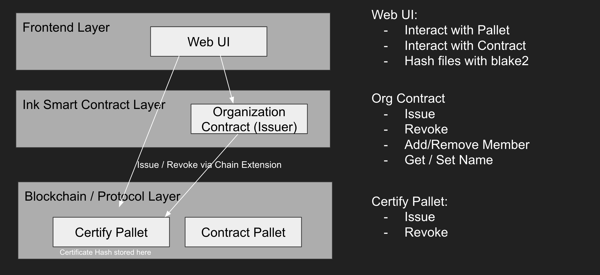
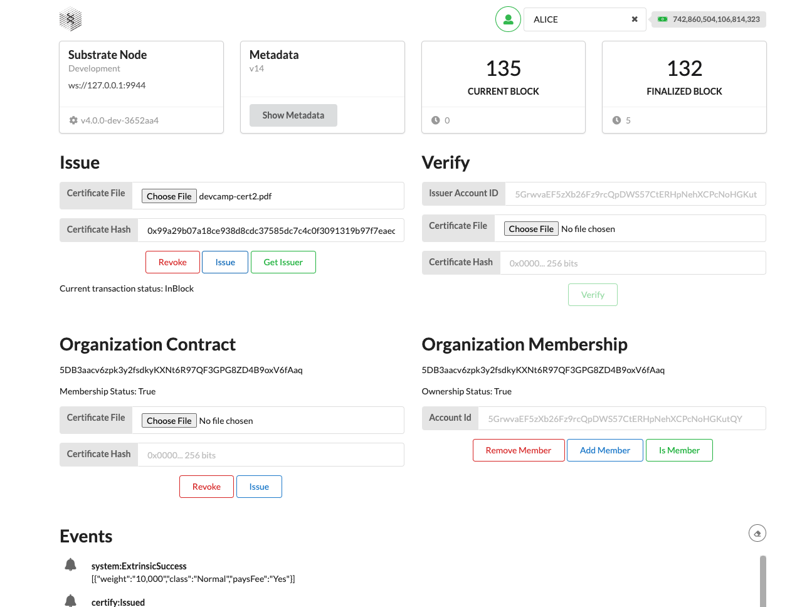

# Certify by Team 1

## Project

A platform for issuing certificates on the blockchain


image source: https://arxiv.org/pdf/1912.06812.pdf

### Concerns

- Certificates contain private information, which should not be stored on chain

### Core Features

- [x] Issuers can issue and revoke certificates
- [x] Anyone can verify the certificate if they have the certificate information

### Extended Features

- [x] Integrate with PolkadotJS Extension
- [x] Integration with Contracts Pallet to give organizations and users the flexibility to control the issuance and revocation of certificates by issuing Ink Smart Contracts
- [ ] Store certificates in encrypted form on IPFS: https://rs-ipfs.github.io/offchain-ipfs-manual/

## High-Level Overview



## UI



## Usage

### Substrate Node

```bash
cd substrate-node-template
cargo build --release
./target/release/node-template --tmp --dev -lruntime::contracts=debug
```

### Org Contract

```bash
cd org_contract
cargo +nightly contract build
```

### Frontend

1. Use https://polkadot.js.org/apps/#/contracts to deploy contract
2. Update `CONTRACT_ADDR` field in `certify-frontend/src/config/common.json` to new contract address
3. `yarn install`
4. `yarn start`

## Challenges

- Ink and Substrate Node compatibility issues: 3.0.1 (v9.17) -> 3.1.0 -> 3.2.0 (v9.22)
- Substrate is big

## Future Improvements

- Weight
- Encrypted File Storage
- Better frontend design and prevent memory leaks

## References

- https://github.com/substrate-developer-hub/substrate-docs/blob/main/v3/how-to-guides/02-pallet-design/a-add-contracts-pallet/index.mdx
- https://ink.substrate.io/macros-attributes/chain-extension/
- https://github.com/paritytech/Runtime-Contract-Interactions/
- https://github.com/paritytech/substrate-contracts-node
- https://substrate.dev/
- https://github.com/paritytech/ink/tree/master/examples
- https://substrate.stackexchange.com/questions/2721/cargo-contract-3-0-1
